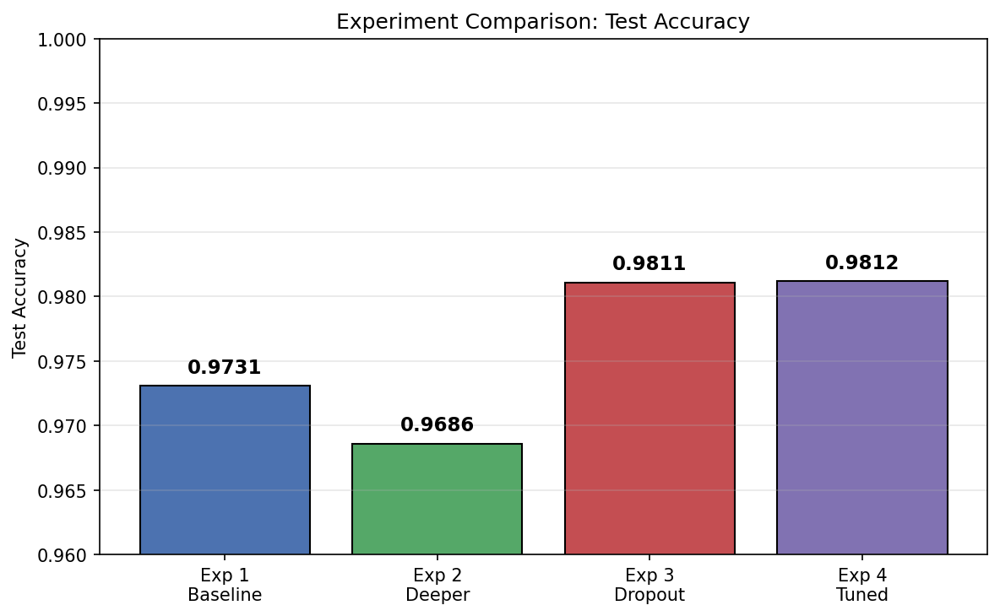
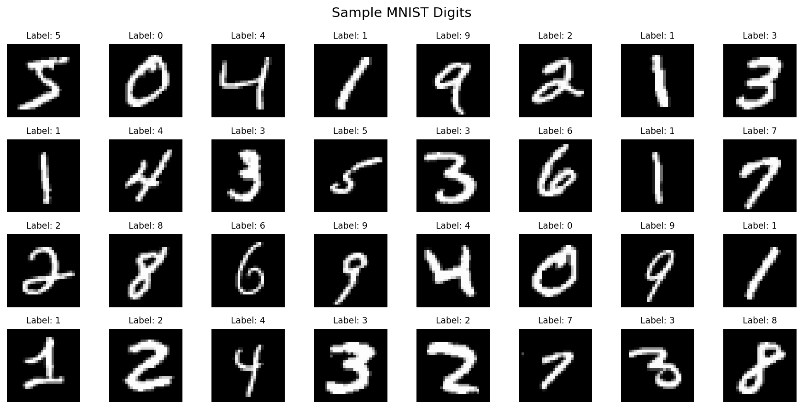
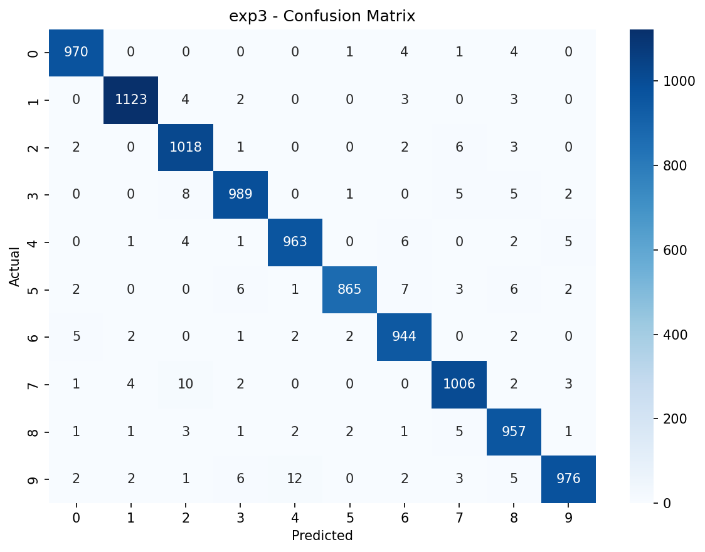
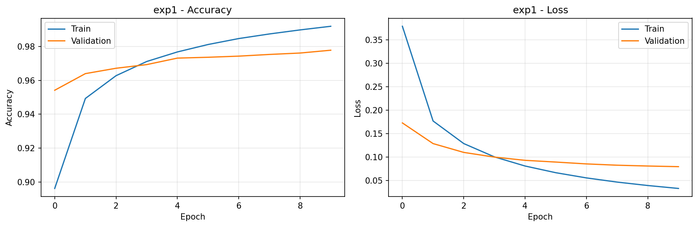
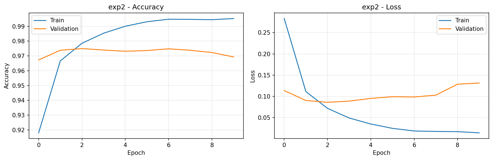
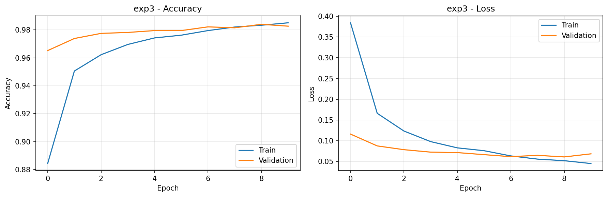
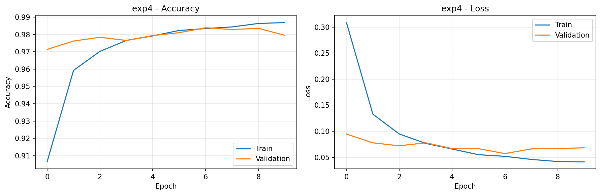
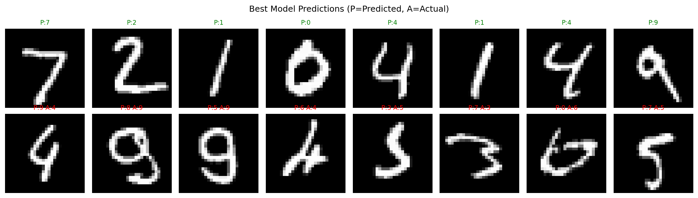

# MNIST Digit Classification with Keras

A neural network classifier for handwritten digits (0-9) using the MNIST dataset. Includes 4 experiments with increasing complexity to demonstrate the effects of depth, width, and dropout regularization.

**[Open the Notebook](mnist_classification.ipynb)**

## Results Summary

| Experiment | Architecture | Test Accuracy |
|-----------|-------------|---------------|
| 1 - Baseline | Dense(128) | 97.31% |
| 2 - Deeper | Dense(256) -> Dense(128) | 96.86% |
| 3 - Dropout | Dense(256) -> Drop(0.3) -> Dense(128) -> Drop(0.2) | 98.11% |
| 4 - Tuned | Dense(512) -> Drop(0.3) -> Dense(256) -> Drop(0.2) -> Dense(128) | 98.12% |

### Accuracy Comparison


### Sample Digits


### Confusion Matrices

| Experiment 1 (Baseline) | Experiment 2 (Deeper) |
|---|---|
|  |  |

| Experiment 3 (Dropout) | Experiment 4 (Tuned) |
|---|---|
|  |  |

### Training Curves

| Experiment 1 | Experiment 2 |
|---|---|
|  |  |

| Experiment 3 | Experiment 4 |
|---|---|
|  |  |

### Sample Predictions


## Key Takeaways

1. **Baseline works well** - Even a single hidden layer achieves ~97% on MNIST
2. **Deeper alone can hurt** - Exp 2 shows that adding depth without regularization can lead to overfitting
3. **Dropout is critical** - Exp 3 jumps to 98.11% by adding dropout regularization
4. **Width + depth + dropout** - Exp 4 combines all three for the best result (98.12%)

## LLM Q&A

### Q: Why did you choose the ReLU activation function?

**ReLU (Rectified Linear Unit)** computes `max(0, x)` — it outputs the input directly if positive, or zero otherwise. We chose it for the hidden layers for several reasons:

1. **Avoids the vanishing gradient problem.** Older activations like sigmoid and tanh squash outputs into small ranges (0-1 or -1 to 1). During backpropagation, gradients get multiplied through many layers, and these small values cause gradients to shrink to near zero — making deep networks almost impossible to train. ReLU's gradient is either 0 or 1, so gradients flow through without shrinking.

2. **Computationally fast.** ReLU is just a comparison (`max(0, x)`), while sigmoid and tanh require exponential calculations (`e^x`). This makes training noticeably faster, especially over millions of parameters and many epochs.

3. **Produces sparse activations.** ReLU zeros out all negative values, meaning many neurons output exactly 0 at any given time. This sparsity makes the network more efficient and can act as a mild form of regularization.

4. **It's the proven default.** ReLU has been the standard activation for hidden layers since ~2012 (AlexNet). For a straightforward classification task like MNIST with Dense layers, there's no reason to use anything more exotic (like LeakyReLU or GELU), which are typically used for more complex architectures.

**Note:** ReLU is only used for *hidden* layers. The *output* layer uses **softmax**, which converts raw scores into probabilities that sum to 1 — required for multi-class classification.

---

### Q: How and why did you choose the number of neurons for each layer in each experiment?

The neuron counts follow a **funnel (narrowing) pattern**: wide at the input, progressively narrower toward the output. This is a standard design principle — early layers capture many low-level features, and later layers compress them into higher-level abstractions.

**The constraints that guided our choices:**
- **Input is fixed at 784** (28x28 pixels flattened)
- **Output is fixed at 10** (one neuron per digit class)
- Hidden layers must bridge the gap between 784 and 10

**Experiment 1 — Dense(128):**
128 is a common starting point for simple baselines. It's a power of 2 (which aligns well with GPU/CPU memory), and it's small enough to be fast while large enough to learn the patterns in MNIST. Going much lower (e.g., 32) would underfit — the layer wouldn't have enough capacity to distinguish 10 digit classes from 784-dimensional input.

**Experiment 2 — Dense(256) → Dense(128):**
We doubled the first layer to 256 to give the network more capacity to learn features, then funnel down to 128. The idea is: the first layer (256) learns many basic patterns (edges, curves), and the second layer (128) combines them into digit-level features. We kept powers of 2 for computational efficiency.

**Experiment 3 — Dense(256) → Dense(128) (+ Dropout):**
Same neuron counts as Exp 2, but with dropout. The point of this experiment is to isolate the effect of dropout — by keeping the architecture identical, any accuracy difference is purely from regularization, not from changing the network's capacity.

**Experiment 4 — Dense(512) → Dense(256) → Dense(128):**
We scaled up to 512 in the first layer (more features to learn from), then funnel through 256 → 128. This creates a 3-level feature hierarchy:
- Layer 1 (512): low-level features (strokes, edges)
- Layer 2 (256): mid-level features (loops, curves, angles)
- Layer 3 (128): high-level features (digit-like shapes)

**Why powers of 2 (128, 256, 512)?**
This is a practical convention, not a strict rule. Powers of 2 align with how memory is allocated on modern hardware (32/64-bit architectures, GPU warp sizes), which can result in slightly faster computation. But 100, 200, 500 would work nearly as well.

**Why not go bigger (e.g., 1024, 2048)?**
MNIST is a simple dataset — 28x28 grayscale images with centered digits. Overly large networks would memorize the training data (overfit) rather than learning generalizable patterns, and would train slower for no meaningful accuracy gain.

---

### Q: Explain the effectiveness of Dropout and how did you choose the percentages?

**What is Dropout?**
Dropout is a regularization technique that randomly "turns off" (sets to zero) a fraction of neurons during each training step. If a layer has `Dropout(0.3)`, then in every training batch, each neuron in that layer has a 30% chance of being temporarily disabled.

**Why is it effective?**

1. **Prevents co-adaptation.** Without dropout, neurons can become overly dependent on each other — neuron A always relies on neuron B's output. Dropout forces each neuron to learn useful features *independently*, because it can't count on any particular neighbor being active. This makes the learned features more robust and generalizable.

2. **Acts like an ensemble.** Each training step uses a different random subset of neurons, which is effectively a different "sub-network." Over many batches, the model trains thousands of overlapping sub-networks. At inference time (when dropout is turned off), the full network acts like an average of all these sub-networks — similar to how ensemble methods (like Random Forest) combine many weak models into a strong one.

3. **Reduces overfitting.** Overfitting happens when a model memorizes training data instead of learning general patterns. Dropout prevents this by making memorization harder — the network can't rely on specific neuron combinations to memorize specific examples.

**Evidence in our experiments:**
- Exp 2 (no dropout): **96.86%** — the deeper network actually *decreased* accuracy vs baseline, suggesting overfitting
- Exp 3 (with dropout, same architecture): **98.11%** — a **1.25% jump** just from adding dropout
- This demonstrates dropout's power: same network capacity, much better generalization

**How we chose the percentages (0.3 and 0.2):**

We used `Dropout(0.3)` after the first hidden layer and `Dropout(0.2)` after the second. This follows a **decreasing dropout rate** pattern toward the output:

1. **Higher dropout (0.3) on wider layers.** The first hidden layer (256 or 512 neurons) has the most parameters and the highest risk of overfitting. A 30% dropout rate provides stronger regularization where it's needed most.

2. **Lower dropout (0.2) on narrower layers.** The second hidden layer (128 neurons) has fewer neurons — too aggressive a dropout here would destroy too much information before the output layer, hurting the model's ability to make accurate predictions.

3. **No dropout on the output layer.** We need all 10 output neurons active to produce valid probability distributions. Dropping output neurons would mean some digit classes get zero probability, making predictions unreliable.

4. **No dropout on the input layer.** While some architectures do use input dropout (typically very low, ~0.1), for MNIST the input is already sparse (most pixels are black/zero), so additional dropout on the input would discard too much of the limited signal.

**Why 0.3/0.2 specifically and not other values?**
- These are well-established defaults from the original dropout paper (Srivastava et al., 2014), which found that dropout rates between 0.2 and 0.5 work well for most tasks
- For MNIST (a relatively easy dataset), moderate rates (0.2-0.3) are sufficient — higher rates (0.5+) would over-regularize and slow convergence unnecessarily
- The 0.3 → 0.2 decreasing pattern is a common heuristic: regularize more aggressively where there are more parameters to overfit

---

### Q: How did you choose how many epochs to run?

**What is an epoch?**
One epoch means the model has seen every single training example once. With 10 epochs, the model passes through all 60,000 training images 10 times, refining its weights with each pass.

**Why 10 epochs?**

1. **MNIST converges quickly.** Looking at our training curves, accuracy plateaus around epoch 5-7 for all experiments. By epoch 10, the models have largely stopped improving. This is because MNIST is a relatively simple dataset — the patterns (digit shapes) are consistent and the images are clean (centered, normalized, no noise).

2. **Validation curves reveal the sweet spot.** The key signal is the *validation* accuracy/loss, not the training accuracy. In our experiments:
   - Training accuracy keeps slowly climbing even past epoch 10 (the model keeps memorizing)
   - Validation accuracy flattens or even starts dipping — this is the onset of overfitting
   - 10 epochs sits right at the point where validation performance has converged but hasn't degraded

3. **Practical training time.** Each epoch on MNIST takes ~3-5 seconds on CPU. 10 epochs means ~30-50 seconds per experiment — fast enough to iterate and compare 4 experiments comfortably. Going to 50 or 100 epochs would waste minutes for negligible gains.

**What happens with fewer epochs?**
- **3-5 epochs:** The model is still learning. Accuracy is climbing and hasn't plateaued. We'd be stopping before the model has fully learned.

**What happens with more epochs?**
- **20-30 epochs:** For experiments without dropout (Exp 1, 2), training accuracy approaches 100% while validation accuracy stagnates or drops — classic overfitting. The model is memorizing training examples rather than learning generalizable patterns.
- **50+ epochs:** Diminishing returns. The extra compute adds almost nothing to test accuracy, and overfitting risk grows.

**A better approach for production: Early Stopping.**
In real-world projects, you wouldn't hardcode the number of epochs. Instead, you'd use Keras's `EarlyStopping` callback, which monitors validation loss and automatically stops training when it stops improving:
```python
callback = keras.callbacks.EarlyStopping(monitor='val_loss', patience=3)
model.fit(X_train, y_train, epochs=100, callbacks=[callback])
```
This sets a high epoch limit (100) but lets the model decide when to stop. We used a fixed 10 epochs here for simplicity and to keep all experiments comparable under identical conditions.

---

### Q: Were the experiments done on the CPU or the GPU?

**CPU only.** During notebook execution, TensorFlow logged the following warnings:

```
Could not find cuda drivers on your machine, GPU will not be used.
Cannot dlopen some GPU libraries... Skipping registering GPU devices...
```

This means TensorFlow detected no CUDA-compatible GPU on this machine, so all training and inference ran entirely on the CPU.

**Does it matter for MNIST?**
Not really. MNIST is a small dataset (60,000 images of 28x28 pixels) with small Dense models (largest is ~270K parameters in Exp 4). Each epoch takes ~3-5 seconds on CPU. The entire notebook (all 4 experiments, 40 total epochs) finishes in under 2 minutes.

**When would a GPU matter?**
A GPU becomes essential when:
- **Datasets are large** — ImageNet has 1.2 million images at 224x224 pixels (vs MNIST's 60K at 28x28)
- **Models are large** — ResNet-50 has 25 million parameters; GPT-3 has 175 billion (vs our largest model's ~270K)
- **Architectures involve heavy computation** — Convolutional layers (CNNs) and attention layers (Transformers) perform massive matrix multiplications that GPUs parallelize efficiently
- **Training takes hours/days** — a GPU can provide 10-100x speedup over CPU for these workloads

For our Dense-layer MNIST experiments, the overhead of transferring data to/from a GPU would actually negate most of the speedup, making CPU the perfectly reasonable choice.

---

### Q: Expand on the softmax activation function.

**What is softmax?**
Softmax is an activation function used on the **output layer** of multi-class classification networks. It takes a vector of raw scores (called **logits**) and converts them into a **probability distribution** — values between 0 and 1 that sum to exactly 1.

**The formula:**
For a vector of logits `z = [z₀, z₁, ..., z₉]`, softmax for class `i` is:

```
softmax(zᵢ) = e^zᵢ / (e^z₀ + e^z₁ + ... + e^z₉)
```

**A concrete example from our model:**
Suppose the output layer produces raw logits for an image of the digit "3":

```
logits:      [-1.2,  0.5, -0.3,  4.8,  0.1, -2.0,  0.3, -0.7,  1.1, -0.5]
                0     1     2     3     4     5     6     7     8     9
```

After softmax:
```
probabilities: [0.002, 0.013, 0.006, 0.952, 0.009, 0.001, 0.011, 0.004, 0.024, 0.005]
                 0      1      2      3      4      5      6      7      8      9
```

The model predicts digit **3** with 95.2% confidence. The probabilities sum to 1.0.

**Why softmax and not just pick the largest value?**

1. **Probabilities are interpretable.** Raw logits like `4.8` have no clear meaning. But `0.952` tells us the model is 95.2% confident — we can set thresholds (e.g., "reject predictions below 80% confidence") or flag uncertain cases for human review.

2. **Required by categorical crossentropy loss.** Our loss function compares the predicted probability distribution against the true one-hot label. It computes: `loss = -log(predicted probability of the correct class)`. If the model assigns 95.2% to the correct class, the loss is `-log(0.952) = 0.049` (low). If it assigns only 10%, the loss is `-log(0.1) = 2.3` (high). This only works with valid probabilities, which is what softmax provides.

3. **Differentiable.** Softmax is smooth and differentiable everywhere, which is essential for backpropagation. The "just pick the largest" approach (argmax) has zero gradient almost everywhere, so the network couldn't learn from it.

**Why softmax only on the output layer?**
- Hidden layers use ReLU because they need to pass information forward without constraining it to sum to 1
- The output layer uses softmax because the final output must be a valid probability distribution — one probability per class, summing to 1
- Using softmax on hidden layers would force each layer's activations to compete (sum to 1), severely limiting the network's ability to learn complex features

**Softmax vs Sigmoid:**
- **Sigmoid** outputs a single value between 0 and 1 — used for binary classification (yes/no) or multi-label problems (each class is independent)
- **Softmax** outputs a vector of values that sum to 1 — used for multi-class classification where exactly one class is correct (like our digit recognition: an image can only be one digit)

---

### Q: Explain the Adam optimizer and why you chose it.

**What is an optimizer?**
An optimizer is the algorithm that updates the model's weights after each batch to minimize the loss function. It decides *how much* and *in what direction* to adjust each weight. The simplest optimizer is **Stochastic Gradient Descent (SGD)**, which updates weights by: `weight = weight - learning_rate * gradient`.

**What is Adam?**
Adam (**Ada**ptive **M**oment Estimation) is an advanced optimizer published by Kingma & Ba in 2014. It improves on basic SGD by combining two ideas:

1. **Momentum (1st moment).** SGD can oscillate back and forth in steep dimensions while making slow progress in flat ones. Adam tracks a running average of past gradients (like a "velocity"), which smooths out these oscillations. Think of it like a ball rolling downhill — momentum helps it roll past small bumps instead of getting stuck.

2. **Adaptive learning rates (2nd moment).** In SGD, every weight uses the same learning rate. But some weights need big updates and others need small ones. Adam tracks a running average of squared gradients for each weight individually, then scales the learning rate accordingly — weights with consistently large gradients get smaller learning rates (to avoid overshooting), and weights with small gradients get larger learning rates (to speed up learning).

**Adam's update rule (simplified):**
```
m = β₁ * m + (1 - β₁) * gradient          # Momentum: smoothed gradient direction
v = β₂ * v + (1 - β₂) * gradient²          # Velocity: smoothed gradient magnitude
weight = weight - lr * m / (√v + ε)         # Update: scaled by both
```

**Default hyperparameters (which we used):**
| Parameter | Default | Purpose |
|-----------|---------|---------|
| `lr` (learning rate) | 0.001 | Base step size for weight updates |
| `β₁` | 0.9 | Decay rate for momentum (gradient average) |
| `β₂` | 0.999 | Decay rate for velocity (squared gradient average) |
| `ε` (epsilon) | 1e-7 | Small constant to prevent division by zero |

**Why we chose Adam:**

1. **Works well out of the box.** Adam's defaults (lr=0.001, β₁=0.9, β₂=0.999) work well for a wide range of tasks without tuning. SGD often requires careful learning rate selection and scheduling to converge properly.

2. **Faster convergence.** Adam typically reaches a good solution in fewer epochs than SGD because the adaptive learning rates help each weight learn at its own pace. For MNIST, Adam converges in ~5-7 epochs while SGD might need 20-30 with careful tuning.

3. **Consistent comparison across experiments.** Since our goal is to compare *architectures* (depth, dropout), we want the optimizer to be a controlled variable. Adam's robustness ensures that differences in accuracy between experiments come from architectural changes, not optimizer sensitivity.

4. **Standard choice for educational projects.** Adam is the most widely used optimizer in tutorials and courses, making this notebook more relatable and easier to follow.

**When would you NOT choose Adam?**
- **Final production models:** SGD with momentum and learning rate scheduling can sometimes generalize *slightly* better than Adam after extensive tuning. Many state-of-the-art image classifiers (ResNets on ImageNet) use SGD for this reason.
- **Very large models (LLMs):** Variants like AdamW (Adam with weight decay) are preferred because standard Adam's L2 regularization interacts poorly with the adaptive learning rates at scale.

---

### Q: Explain categorical crossentropy — the loss function.

**What is a loss function?**
A loss function measures "how wrong" the model's predictions are. After each batch, the optimizer uses this measurement to adjust weights in the direction that reduces the error. Without a loss function, the model has no signal to learn from.

**What is categorical crossentropy?**
It measures the distance between two probability distributions: the model's predicted probabilities (from softmax) and the true label (one-hot encoded). The formula for a single sample is:

```
loss = -Σ yᵢ * log(pᵢ)     for i = 0, 1, ..., 9
```

Where `yᵢ` is the true label (1 for the correct class, 0 for all others) and `pᵢ` is the predicted probability for class `i`.

Since `yᵢ` is 0 for all classes except the correct one, this simplifies to:

```
loss = -log(p_correct)
```

**A concrete example:**
If the true digit is `3` and the model predicts:
- P(3) = 0.95 → loss = -log(0.95) = **0.05** (low loss — good prediction)
- P(3) = 0.10 → loss = -log(0.10) = **2.30** (high loss — bad prediction)
- P(3) = 0.01 → loss = -log(0.01) = **4.61** (very high loss — terrible prediction)

**Key properties:**
1. **Heavily penalizes confident wrong answers.** If the model says "I'm 99% sure it's a 7" but it's actually a 3, the loss is `-log(0.01) = 4.61`. This steep penalty forces the model to not just be right, but to be calibrated — confident only when it should be.
2. **Rewards confident correct answers.** Low loss requires both correctness and high confidence.
3. **Works hand-in-hand with softmax.** Softmax provides valid probabilities; crossentropy measures how far those probabilities are from the truth. Their gradients combine elegantly during backpropagation, making training numerically stable.

**Why not Mean Squared Error (MSE)?**
MSE (`(predicted - true)²`) is common for regression, but it's suboptimal for classification because:
- Its gradients are small when predictions are very wrong (the sigmoid/softmax saturation regions), so learning is slow precisely when the model needs the most correction
- Categorical crossentropy's `-log` curve produces large gradients for wrong predictions, driving faster learning

---

### Q: Why batch size 128? Why not 1 or all 60,000?

**What is batch size?**
Batch size is the number of training samples processed before the model updates its weights once. With batch size 128 and 60,000 training samples, each epoch performs `60,000 / 128 = 469` weight updates.

**The three extremes:**

| Approach | Batch Size | Updates per Epoch | Behavior |
|----------|-----------|-------------------|----------|
| **Stochastic GD** | 1 | 60,000 | Very noisy gradients, slow (no parallelism) |
| **Mini-batch GD** | 32-512 | 117-1,875 | Best of both worlds |
| **Batch GD** | 60,000 | 1 | Exact gradients, but very slow to converge and huge memory usage |

**Why 128 specifically?**

1. **Gradient quality.** With batch size 1, each gradient estimate is based on a single example — extremely noisy. With 128 examples, the gradient is averaged over 128 samples, giving a much more reliable direction for weight updates while still maintaining some beneficial noise.

2. **Computational efficiency.** Modern CPUs and GPUs are optimized for matrix operations on batches. Processing 128 images at once is much faster than processing 1 image 128 times, because the hardware can parallelize the matrix multiplications.

3. **Memory fits comfortably.** 128 images × 784 pixels × 4 bytes (float32) = ~400 KB per batch. This fits easily in CPU cache. With 60,000 images it would be ~188 MB — still manageable, but the single gradient update per epoch makes convergence very slow.

4. **Generalization.** Research has shown that smaller batches (32-256) often generalize better than very large batches (8,000+). The noise in small-batch gradients acts as implicit regularization, helping the model find "wider" minima in the loss landscape that generalize better to unseen data.

5. **Power of 2.** Like neuron counts, powers of 2 align with hardware memory architecture for marginally better performance.

**If we changed it:**
- **Batch size 32:** More weight updates per epoch (1,875 vs 469), potentially more fine-grained learning, but slower wall-clock time per epoch
- **Batch size 512:** Fewer updates (117), faster epochs, but each update is based on a smoother (less noisy) gradient — may converge to sharper minima that generalize slightly worse

---

### Q: Why validation split of 0.1? What's the difference between validation and test sets?

**The three data splits:**

| Split | Size | When used | Purpose |
|-------|------|-----------|---------|
| **Training** | 54,000 (90%) | During training | Model learns from this data |
| **Validation** | 6,000 (10%) | During training (but model doesn't learn from it) | Monitor for overfitting, tune hyperparameters |
| **Test** | 10,000 | After training is complete | Final unbiased performance evaluation |

**Why do we need both validation AND test sets?**
This is a crucial distinction:

- The **validation set** is used *during* development to make decisions: "Should I add dropout? Should I train for more epochs? Is the model overfitting?" Because we make decisions based on validation performance, we subtly "leak" information — we're indirectly optimizing for the validation set.
- The **test set** is touched *only once*, at the very end, to get an unbiased accuracy number. It answers: "How will this model perform on truly unseen data?"

If we used the test set to make decisions during development, our final reported accuracy would be optimistically biased.

**Why 10% for validation?**

1. **MNIST has plenty of data.** 54,000 training examples is more than enough for our small models to learn from. Losing 6,000 to validation barely affects training quality.

2. **6,000 samples is statistically reliable.** With 6,000 validation samples (~600 per digit), the validation accuracy estimate has a small standard error (~0.2%), meaning we can trust it to distinguish real improvements from noise.

3. **Common default.** 10% validation split is a widely used default. For smaller datasets, you might use 20% or even k-fold cross-validation. For very large datasets (millions), even 1-2% validation is sufficient.

**What `validation_split=0.1` does in Keras:**
Keras takes the **last 10%** of the training data (not a random sample) as the validation set. It does this before shuffling, so the split is deterministic. The model never trains on these 6,000 samples — it only evaluates on them at the end of each epoch to report `val_accuracy` and `val_loss`.

---

### Q: What are the limitations of flattening, and why would CNNs be the next step?

**What flattening does:**
We reshape each 28x28 image into a 784-length 1D vector before feeding it to our Dense layers. This means pixel `(0,0)` and pixel `(27,27)` are treated the same as pixel `(0,0)` and pixel `(0,1)` — the network has no concept of which pixels are *neighbors*.

**What we lose:**

1. **Spatial relationships.** In the digit "8", the top loop and bottom loop are spatially related — they're vertically aligned. After flattening, this spatial structure is lost. The network must learn from raw pixel correlations across 784 dimensions that pixel 14 (row 0, col 14) and pixel 406 (row 14, col 14) are vertically aligned — something that's obvious in 2D but hidden in 1D.

2. **Translation invariance.** If a digit is shifted a few pixels to the right, *every* pixel value changes in the flattened representation. The Dense network must learn the same digit in every possible position separately. This is inefficient and a major reason Dense networks struggle with more complex image tasks.

3. **Local patterns.** The stroke that makes the top of a "7" is a local pattern — it involves a small cluster of neighboring pixels. Dense layers connect every input pixel to every neuron, wasting capacity on learning relationships between distant, unrelated pixels.

**How CNNs (Convolutional Neural Networks) solve this:**

CNNs operate directly on the 2D image using **convolutional filters** — small windows (e.g., 3x3) that slide across the image:

```
Dense layer:  every pixel → every neuron     (784 × 128 = 100,352 connections)
Conv layer:   3×3 window → 1 output value    (9 connections, reused across image)
```

1. **Preserve spatial structure.** Filters operate on local neighborhoods, so the network naturally understands which pixels are adjacent.

2. **Translation invariant.** The same filter slides across the entire image, so a "7" detected in the top-left uses the same learned pattern as a "7" in the center.

3. **Parameter efficient.** A 3x3 filter has only 9 parameters but is applied hundreds of times across the image. Dense layers need a separate weight for every pixel-to-neuron connection.

4. **Better accuracy.** CNNs achieve **99.5-99.7%** on MNIST (vs our best of 98.12%), and the gap is even larger on complex datasets like CIFAR-10 or ImageNet.

**Why didn't we use CNNs?**
The assignment specifically requires flattening and Dense layers. This is pedagogically valuable — understanding Dense networks and their limitations is essential before appreciating why CNNs were invented.

---

## Setup

```bash
uv sync
uv run jupyter notebook mnist_classification.ipynb
```

## Testing

```bash
uv run pytest tests/ -v
```

## Project Structure

```
mnist/
├── mnist_classification.ipynb   # Main notebook with all experiments
├── results/                     # Saved plots and metrics
├── tests/                       # Unit tests
│   ├── test_preprocessing.py    # Pre-training: data validation
│   ├── test_model.py            # Pre-training: architecture validation
│   └── test_evaluation.py       # Post-training: output validation
└── docs/
    ├── PRD.md                   # Product requirements
    ├── TASKS.md                 # Task tracking
    └── PLANNING.md              # Architecture & planning
```
